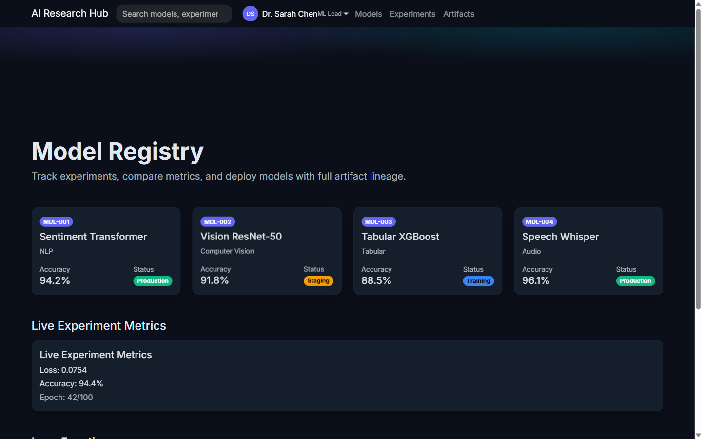

# AI Research Hub

`showcase/ai_research_hub.py` is an ML experiment tracker and model registry reference in Faststrap.

It demonstrates research-oriented dashboards, live metrics, and artifact management with a premium dark-mode aesthetic.

## Gallery

## What It Shows

- `create_theme()` with AI/tech indigo/cyan palette
- `DataCard` for model metadata (accuracy, status, type)
- `SearchBar` with HTMX live model filtering
- `ProfileDropdown` for researcher account menu
- `FilePreview` for model artifacts (ONNX, checkpoints, configs)
- `Math` for rendered loss/metric formulas (KaTeX CDN)
- `AutoRefresh` for live experiment metrics
- `DashboardGrid` for model summary cards
- `Fx` entrance animations throughout
- mobile-first responsive design

## Why It Matters

AI Research Hub is useful for teams evaluating whether Faststrap can support:

- ML experiment tracking interfaces
- model registry and artifact management
- research-oriented dashboards with live metrics
- dark-mode-first developer tools

## Source

- `showcase/ai_research_hub.py`
