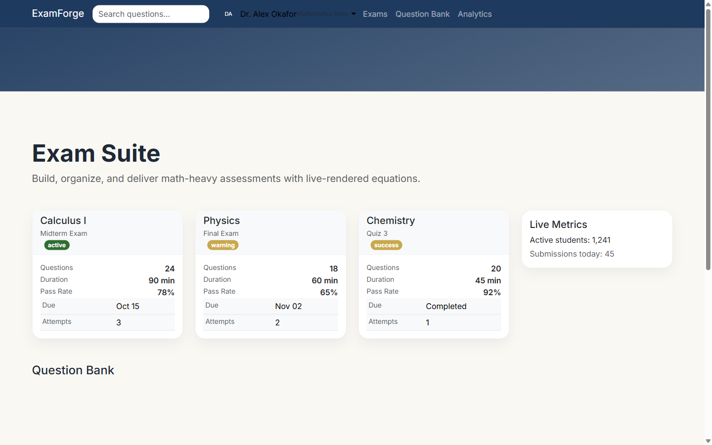

# Showcase Gallery

Faststrap keeps a dedicated `showcase/` layer for polished, production-style references.

These are not tiny component demos. They are fuller applications and landing pages meant to show what the framework looks like when the design system, layout, and interaction patterns are working together.

## Why The Showcase Layer Exists

The smaller examples in `examples/` are still useful for learning individual APIs, but they do not fully communicate the visual ceiling of the framework.

The showcase layer exists to highlight:

- premium landing pages
- dense internal dashboards
- vertical product applications
- polished client-facing websites

## Current Flagship Set

### Product and SaaS

- `showcase/novaflow_ai_saas.py`
- `showcase/fastcloud_generated_saas.py` as a rescued/minimal comparison point
- `showcase/saas_landing.py` as a legacy comparison point
- `showcase/generated_saas.py` as a smaller polished SaaS reference
- `showcase/hotel_booking_showcase.py` as a luxury hospitality landing

### Dashboards and Data

- `showcase/atlas_command_center.py`
- `showcase/northstar_ops_dashboard.py`
- `showcase/admin_dashboard.py` as a legacy dashboard comparison point
- `showcase/analytics_dashboard.py` as a compact analytics reference
- `showcase/ledgerleaf_finance.py`

### Portfolio and Brand Sites

- `showcase/agency_portfolio.py`
- `showcase/lexbridge_corporate.py`
- `showcase/furniture_store_showcase.py`

### Vertical Product Apps

- `showcase/onboardflow_workspace.py`
- `showcase/carenest_clinic.py`
- `showcase/learnloop_academy.py`
- `showcase/forgedocs_platform.py`

### v0.9.0+ Showcases

- `showcase/education_exam_suite.py` — exam/question-bank management with Math, Switcher, SplitPane
- `showcase/ai_research_hub.py` — ML experiment tracker with DataCard, SearchBar, ProfileDropdown
- `showcase/saas_admin_portal.py` — modern SaaS admin dashboard with SplitPane, SearchBar, DataCard

## Reference Quality Matrix

Use this table when choosing a reference to study first.

| Showcase | Role | Best Use |
| --- | --- | --- |
| `showcase/atlas_command_center.py` | Flagship v0.7.0 | Operations dashboards using CommandPalette, ChartJS, ModernToast, Timeline, and DataTable helpers |
| `showcase/onboardflow_workspace.py` | Flagship v0.7.0 | Onboarding/workflow apps using FormWizard, live validation, ConfirmAction, AvatarGroup, and GSAP motion |
| `showcase/novaflow_ai_saas.py` | Flagship | Premium SaaS landing pages |
| `showcase/northstar_ops_dashboard.py` | Flagship | Analytics, operations, and internal dashboards |
| `showcase/hotel_booking_showcase.py` | Premium | Luxury, hospitality, and editorial product marketing |
| `showcase/ledgerleaf_finance.py` | Strong | Mobile-aware finance and account surfaces |
| `showcase/learnloop_academy.py` | Strong | Education and progress-driven product apps |
| `showcase/furniture_store_showcase.py` | Strong | Commerce and product storytelling |
| `showcase/agency_portfolio.py` | Strong | Brand-heavy portfolio and agency sites |
| `showcase/forgedocs_platform.py` | Strong | Documentation-oriented product shells |
| `showcase/education_exam_suite.py` | Strong | Exam management with Math, Switcher, SplitPane, SearchBar |
| `showcase/ai_research_hub.py` | Strong | ML research hub with DataCard, SearchBar, ProfileDropdown, Math |
| `showcase/saas_admin_portal.py` | Strong | SaaS admin with SplitPane, SearchBar, ProfileDropdown, DataCard |
| `showcase/carenest_clinic.py` | Acceptable | Healthcare and trust-heavy layouts |
| `showcase/analytics_dashboard.py` | Good | Compact analytics UI with polish |
| `showcase/generated_saas.py` | Good | Smaller polished SaaS, dark-mode-first |
| `showcase/fastcloud_generated_saas.py` | Rescued | Compact comparison example, not the premium default |
| `showcase/admin_dashboard.py` | Legacy | Simpler dashboard baseline and comparison |
| `showcase/saas_landing.py` | Legacy | Older SaaS baseline and comparison |

## Selected Gallery

### NovaFlow AI SaaS

### Northstar Ops Dashboard

### FastCloud Generated SaaS

### Agency Portfolio

### Hotel Booking Showcase

### LearnLoop Academy

### LedgerLeaf Finance

### Lexbridge Corporate

### Furniture Store Showcase

### ForgeDocs Platform

### Carenest Clinic

### Education Exam Suite

### AI Research Hub

### SaaS Admin Portal

## Screenshot Assets

Showcase screenshots live in:

- `docs/assets/showcase/`

That keeps the documentation pages, README, and future gallery updates aligned around one asset location.

