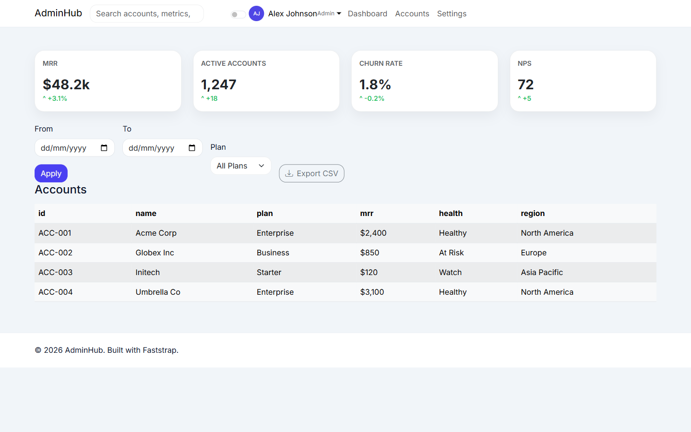

# SaaS Admin Portal

`showcase/saas_admin_portal.py` is a modern SaaS admin dashboard reference in Faststrap.

It demonstrates account management, metric tracking, and export workflows with a clean light/dark admin aesthetic.

## Gallery

## What It Shows

- `create_theme()` with modern SaaS slate/indigo palette
- `SearchBar` with HTMX live account search
- `ProfileDropdown` for admin user menu
- `DataCard` for account metadata
- `FilterBar` with `DateRangePicker` and `Select`
- `ExportButton` for CSV export
- `DataTable` with sort/pagination
- `AutoRefresh` for live metrics
- `DashboardGrid` for KPI cards
- `ThemeToggle` for light/dark mode
- mobile-first responsive design

## Why It Matters

SaaS Admin Portal is useful for teams evaluating whether Faststrap can support:

- SaaS admin and account-management dashboards
- metric-heavy operational interfaces
- export and filtering workflows
- clean, professional admin aesthetics

## Source

- `showcase/saas_admin_portal.py`
